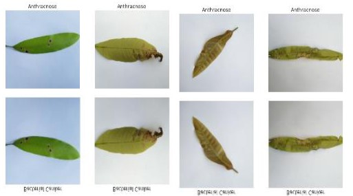
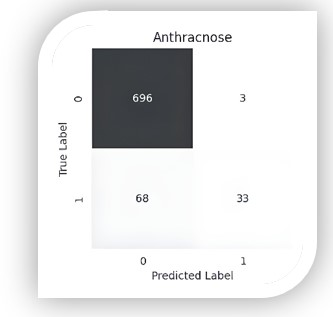

# Mango Leaf Disease Classification 🍃

### Deep Learning-Based Mango Leaf Disease Detection Using VGG16

This project presents a machine learning approach for classifying mango leaf diseases using image processing and deep learning techniques. The system aims to assist farmers and agricultural specialists in identifying mango leaf diseases automatically from leaf images.

---

## 🚀 Features

- Automatic Mango Leaf Disease Classification
- Deep Feature Extraction using VGG16
- Feature Selection with Lasso and Ridge Regularization
- Disease Classification using K-Nearest Neighbors (KNN)
- Data Exploration and Visualization
- Performance Evaluation using Multiple Metrics

---

## 📊 Dataset

The dataset contains 4000 mango leaf images distributed across 8 classes:

- Healthy
- Anthracnose
- Bacterial Canker
- Cutting Weevil
- Die Back
- Gall Midge
- Powdery Mildew
- Sooty Mould

Each class contains approximately 500 images.

### Data Preprocessing

- Image Resizing (224 × 224 × 3)
- Image Augmentation
- Train / Validation / Test Split
- One-Hot Encoding

---

## 🏗️ Model Pipeline

Input Image

↓
VGG16 Feature Extraction

↓
Lasso & Ridge Feature Selection

↓
KNN Classification

↓
Disease Prediction

---

## 🧠 Technologies Used

- Python
- TensorFlow / Keras
- VGG16
- Scikit-Learn
- KNN
- Lasso (L1)
- Ridge (L2)
- Pandas
- NumPy
- Matplotlib
- Seaborn

---

## 📈 Results

- Extracted deep features using VGG16 pretrained network.
- Reduced irrelevant and correlated features using Lasso and Ridge regularization.
- Classified mango leaf diseases using KNN.
- Achieved an overall classification accuracy of **86%**. :contentReference[oaicite:0]{index=0}

---

## 📊 Evaluation Metrics

- Accuracy
- Precision
- Recall
- F1-Score
- Confusion Matrix

---

## 📸 Screenshots

### Dataset Samples

### Confusion Matrix

---

## 🎓 Academic Project

Faculty of Computers and Artificial Intelligence – Cairo University

Published: December 2023
